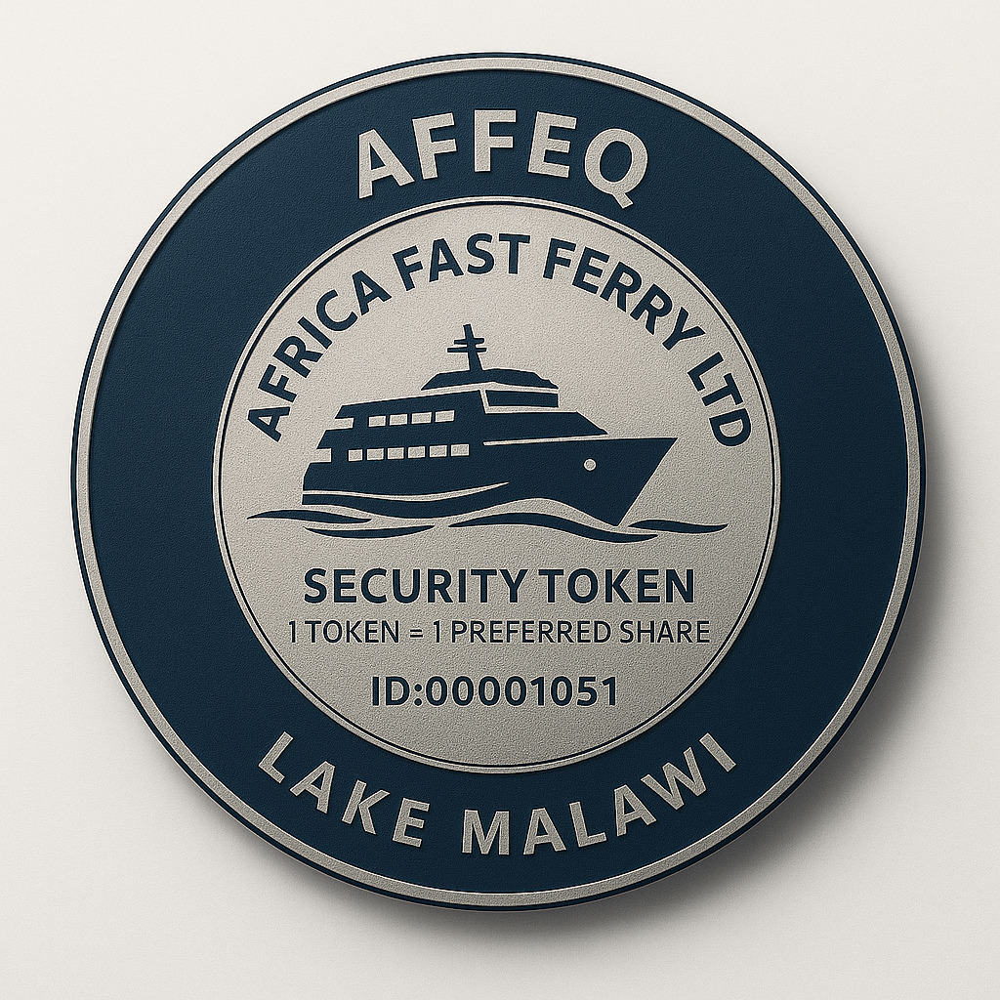
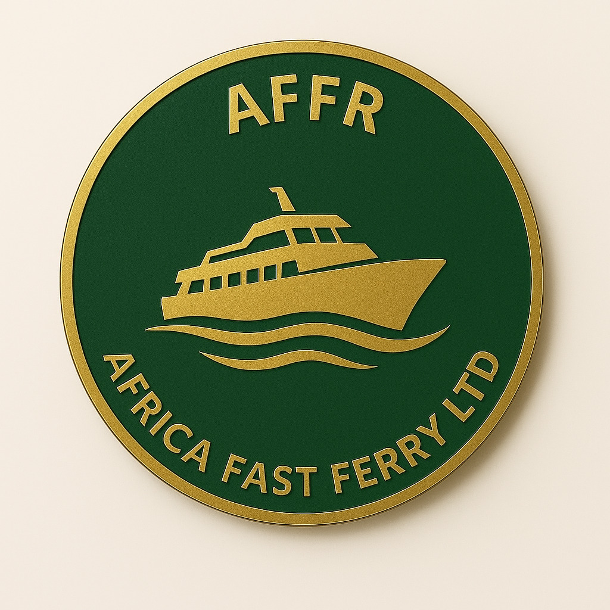

# Africa Fast Ferry Ltd Security Token Contracts

Welcome to the official smart contract repository for **Africa Fast Ferry Ltd**, a tokenized infrastructure company building and operating high-speed ferry systems across Africa.

This repository includes:
- ✅ Production-grade Ethereum smart contracts
- ✅ Visual branding assets (AFFEQ, AFFR)
- ✅ Project documentation and metadata

## 🔐 Token Overview

| Token         | Symbol | Supply       | Purpose                                      |
|---------------|--------|--------------|----------------------------------------------|
| Equity Token  | AFFEQ  | 500,000,000  | Represents ownership in Africa Fast Ferry Ltd |
| Revenue Token | AFFR   | 250,000,000  | Entitles holders to a share of project revenue |

These tokens are built on the **ERC-3643 (formerly ERC-1400)** standard for compliant, modular digital securities.

---

## 🖼️ Token Mockups

Visual representations of our tokenized assets are stored in the [`branding/`](./branding/) folder:

### AFFEQ Token (Equity)


### AFFR Token (Revenue)


---

## ⚙️ Smart Contract Features

- Compliant with **SEC Reg D Rule 506(c)** and **Regulation S**
- KYC/AML whitelist enforcement
- Role-based permissioning with `AccessControl`
- Transfer restrictions and lockups
- Revenue distribution logic (for AFFR)
- Upgradeable & pausable architecture

---

## 📁 Repository Structure

```
contracts/             → Solidity smart contracts
├── AfricaFastFerryToken.sol

branding/              → Token designs, logos, and visual assets
scripts/               → Deployment scripts (optional)
test/                  → Test files (optional)
README.md              → Project documentation
LICENSE                → MIT License
```

---

## 🚀 Deployment Requirements

- Solidity `^0.8.20`
- Recommended: [Hardhat](https://hardhat.org/) or [Foundry](https://book.getfoundry.sh/)
- Compatible with Ethereum mainnet and testnets

> Deployment scripts and upgrade strategies will be provided in a future release.

---

## 👥 Contributors

- **Smart Contract Architecture:** Simon Kapenda 
- **Project Sponsor:** Africa Fast Ferry Ltd  
- **Security Token Standard:** ERC-3643  
- **Governance & Oversight:** Abba Platforms Inc.

---

## 🌐 Additional Links

- 🌍 [Project Website](https://africafastferry.com)  
- 💼 [LinkedIn](https://linkedin.com/company/africafastferry)  
- 🔗 [Smart Contract](./AfricaFastFerryToken.sol)  
- 🖼️ [Branding Assets](./branding/)

---

## 📜 License

This project is licensed under the MIT License. You are free to use, copy, modify, merge, publish, distribute, sublicense, and/or sell copies of the software, subject to the following conditions:

1. The above copyright notice and this permission notice shall be included in all copies or substantial portions of the Software.
2. The software is provided "as is", without warranty of any kind, express or implied, including but not limited to the warranties of merchantability, fitness for a particular purpose, and noninfringement.
3. In no event shall the authors or copyright holders be liable for any claim, damages, or other liability, whether in an action of contract, tort, or otherwise, arising from, out of, or in connection with the software or the use or other dealings in the software.

See the full [LICENSE](LICENSE) file for details.
